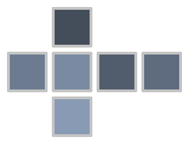

# CubePlayer

CubePlayer is a 3D visualization tool for twisting cube puzzles. It allows a user to specify an initialcube configuration and then to animate an arbitrary sequence of turns and rotations.

CubePlayer has been developed for demonstrating the results of execution of [CubeLang](https://github.com/poletaevvlad/CubeLang) programs.


## Installation

In order to install and run CubePlayer you will need Python 3.7 or newer. 

The easiest way to install this program is via pip:

```bash
pip install git+https://github.com/poletaevvlad/CubePlayer.git
```

If pip is not available you may clone this repository and install package via setuptools:

```bash
git clone https://github.com/poletaevvlad/CubePlayer.git
cd CubePlayer
python setup.py install
```

## Usage

CubePlayer is a CLI application. 
```
usage: cubeplayer [-h] [--no-ui] [--ui-scale UI_SCALE] [--resolution N N]
                  [--scale S] [--camera-angle D D D] [--msaa N_SAMPLES] [-d N]
                  [-s FORMULA] [--front COLORS] [--back COLORS]
                  [--left COLORS] [--right COLORS] [--top COLORS]
                  [--bottom COLORS] [--video FILE] [--video-fps FPS]
                  [--ffmpeg PATH] [--ffmpeg-out] [--time-before MS]
                  [--time-after MS] [--time-turn MS] [--time-turn2 MS]
                  [--time-rotate MS] [--time-rotate2 MS] [--label PATH]
                  [--label-side SIDE] [--label-position I I]
                  [--bg-theme THEME | --bg-colors CLR CLR] [--theme THEME]
                  [--color-red CLR] [--color-green CLR] [--color-orange CLR]
                  [--color-blue CLR] [--color-white CLR] [--color-yellow CLR]
                  [formula]
```
```
positional arguments:
  formula               turns and rotations that will be animated
```
Twisting cube algorithm is a series of actions that will be animated by this program. It uses the same syntax as CubeLang. Please refer to its [documentation](https://github.com/poletaevvlad/CubeLang/blob/master/docs/actions.md) for more innformation. 

As an example, `RUR'U'` would execute so called "sexy move".

```
optional arguments:
  -h, --help            show this help message and exit
  --no-ui               hide the sequence of actions at the bottom of a screen
  --ui-scale UI_SCALE   user interface scale
```

CubePlayer's UI consists of the sequence of actions displayed at the bottom of the window.

```
rendering options:
  --resolution N N      resolution of a frame (width, height)
  --scale S             cube scale
  --camera-angle D D D  camera angle in degreese
  --msaa N_SAMPLES      number of samples for multisample antialiasing (MSAA)
```

```
cube options:
  -d N                  dimensions of a cube
  -s FORMULA            formula to scramble a cube
  --front COLORS        colors of the front face of a cube
  --back COLORS         colors of the back face of a cube
  --left COLORS         colors of the left face of a cube
  --right COLORS        colors of the right face of a cube
  --top COLORS          colors of the top face of a cube
  --bottom COLORS       colors of the bottom face of a cube
```

By default CubePlayer will visualize 3x3x3 cube with traditional sticker coloring. `-s` option describes a series of action to scrmble the cube. Colors can also be specified directly: `--front RRO/GRO/WWB` would ensure that the front face of 3x3x3 cube has red, red and ornage stickers on the first row, green, red and orange on the second row and white, white and blue sticker on the bottom row.

```
video output options:
  --video FILE          path to the output video file
  --video-fps FPS       frame rate of the video
  --ffmpeg PATH         path to a ffmpeg executable
  --ffmpeg-out          show output generated by ffmpeg
```
Instead of displaying the visualization on the screen in can be written into the video file. On order for these options to work ffmpeg should be installed. If you are using Windows OS you need to specify the path to the ffmpeg executable using `--ffmpeg` option. If there are any issues use `--ffmpeg-out` option to show the output of the ffmpeg program.

```
timing options:
  --time-before MS      delay before starting an animation
  --time-after MS       delay after the end of the last animation
  --time-turn MS        duration of a turn animation
  --time-turn2 MS       duration of a double turn animation
  --time-rotate MS      duration of a 90 degrees rotation animation
  --time-rotate2 MS     duration of a 180 degrees rotation animation
```

Timing is specified as a floating point value in seconds. Delay after the last animation is only relevant when generating video output.

```
label options:
  --label PATH          path to a label file
  --label-side SIDE     cube's side with a label
  --label-position I I  index of row and column of the labeled component
```

A label is an image placed on one of the stickers. A label file is a path to a semitransparent image such as PNG.

```
color options:
  --bg-theme THEME      background color theme
  --bg-colors CLR CLR   colors for the background
  --theme THEME         cube stickers color theme
  --color-red CLR       color of the red sticker
  --color-green CLR     color of the green sticker
  --color-orange CLR    color of the orange sticker
  --color-blue CLR      color of the blue sticker
  --color-white CLR     color of the white sticker
  --color-yellow CLR    color of the yellow sticker
```

Colors are specified as a 6 digit hexadecimal values (for example, `FF0000` would produce a bright red color). There are four built-in background themes:

| grays | light | black | white |
|-------|-------|-------|-------|
|  |  |  |  |

And there are also three sticker color themes.

| default | gray | blues |
|---------|------|-------|
|  |  |  |
